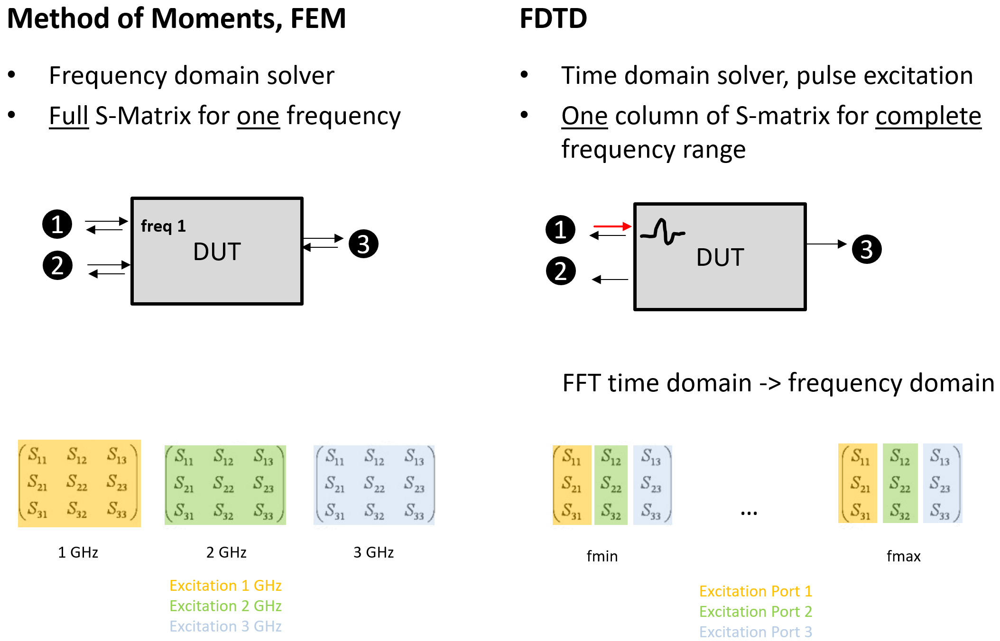
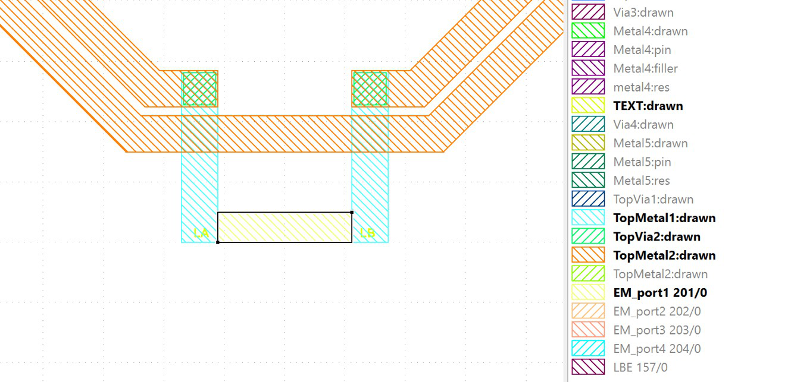
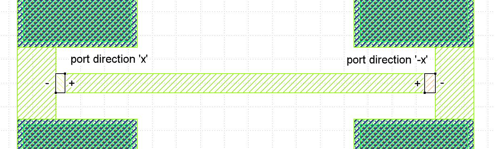
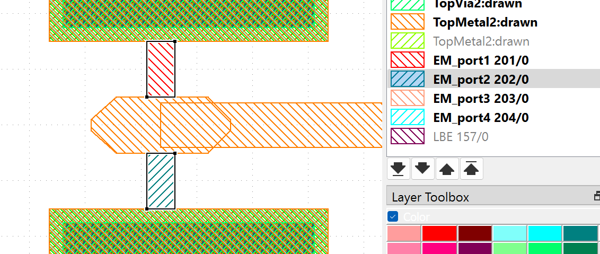
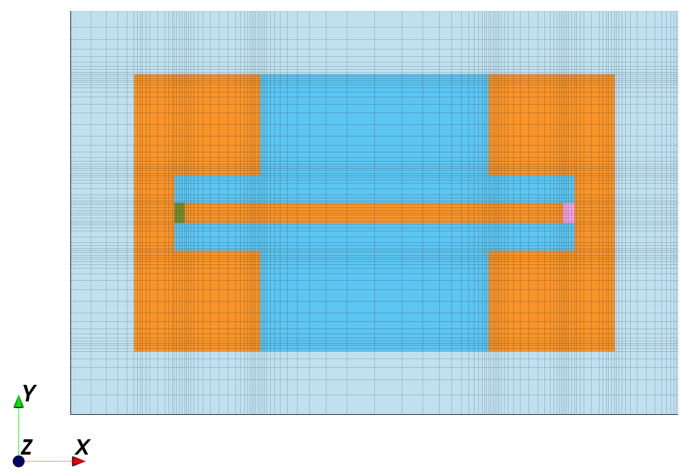
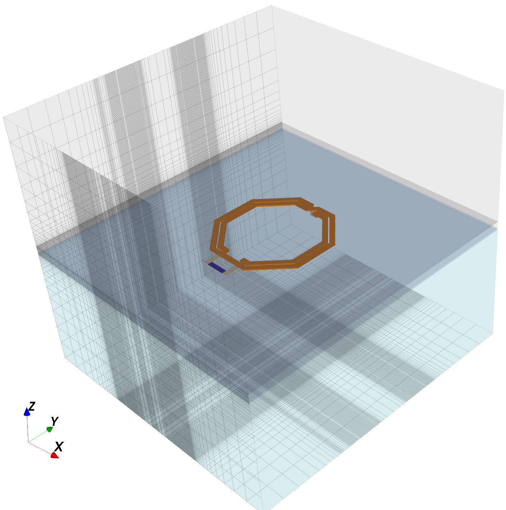
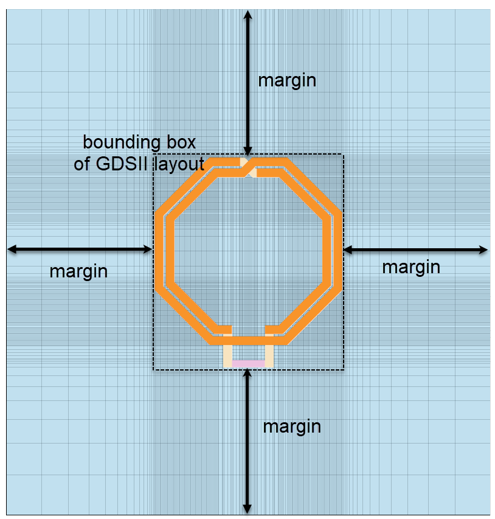
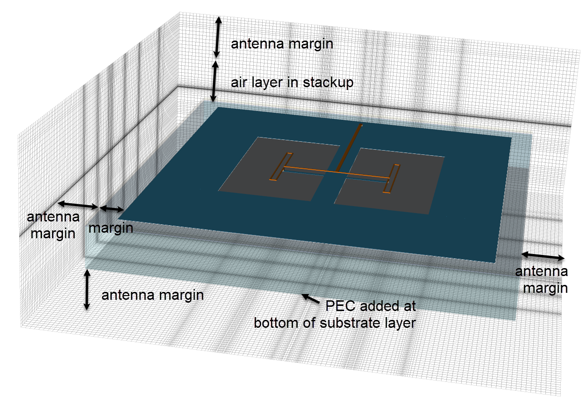
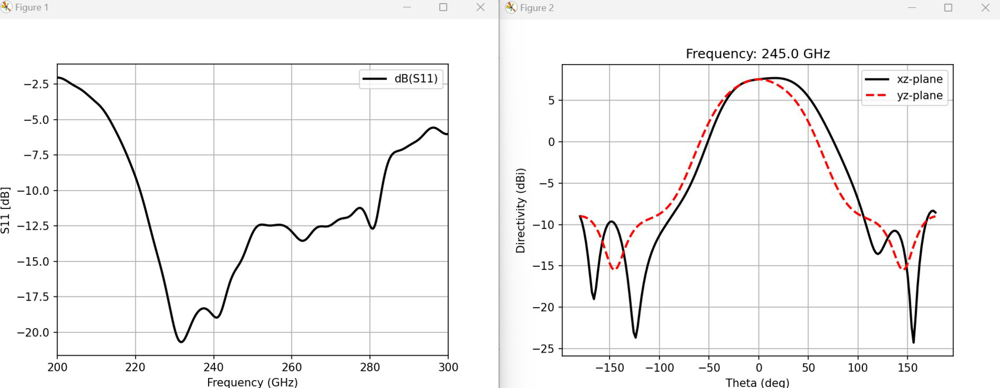
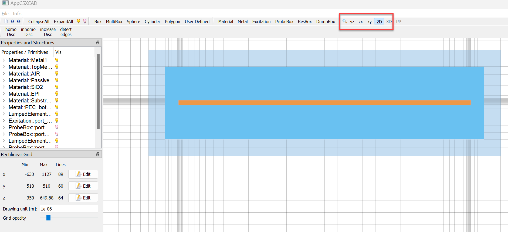

# Using openEMS with IHP SG13: User's Guide

Volker Mühlhaus, volker@muehlhaus.com
---
Document version: 2026-09-02 (v3)

## Contents
[What's New](#whats-new)
[About this workflow](#about-this-workflow)
&ensp;[Method of Moments / FEM vs. FDTD](#method-of-moments--fem-vs-fdtd)
[Getting the code: pip package vs. local copy](#getting-the-code-pip-package-vs-local-copy)
&ensp;[Recommended: install gds2openEMS as a Python module](#recommended-install-gds2openems-as-a-python-module)
&ensp;[Alternative, no longer recommended: local modules copy](#alternative-no-longer-recommended-local-modules-copy)
[Required software and Python modules](#required-software-and-python-modules)
[Model configuration syntax: settings{} dict vs. loose variables](#model-configuration-syntax-settings-dict-vs-loose-variables)
[Quick tour](#quick-tour)
&ensp;[Minimum configuration](#minimum-configuration)
&ensp;[Input files](#input-files)
&ensp;[Port definitions](#port-definitions)
&ensp;[Meshing](#meshing)
&ensp;[Running the model: preview, mesh, simulate](#running-the-model-preview-mesh-simulate)
&ensp;[Re-running a model: the hash-based skip](#re-running-a-model-the-hash-based-skip)
&ensp;[Output files and Touchstone conversion](#output-files-and-touchstone-conversion)
[The settings{} dictionary in detail](#the-settings-dictionary-in-detail)
&ensp;[Required settings](#required-settings)
&ensp;[Optional settings](#optional-settings)
[Simulation volume and boundaries](#simulation-volume-and-boundaries)
[Field dumps](#field-dumps)
[Antenna simulation](#antenna-simulation)
[Port parasitics and de-embedding](#port-parasitics-and-de-embedding)
[Advanced topics](#advanced-topics)
&ensp;[Forcing the solver thread count](#forcing-the-solver-thread-count)
&ensp;[Automatic meshing with easyMesh4openEMS](#automatic-meshing-with-easymesh4openems)
&ensp;[Overriding XML stackup `<Variable>` from the model code](#overriding-xml-stackup-variable-from-the-model-code)
[Examples](#examples)
[FAQ](#faq)
[Appendix](#appendix)
&ensp;[Keeping the local-copy example in sync](#keeping-the-local-copy-example-in-sync)
&ensp;[List of examples](#list-of-examples)

## What's New

This chapter gives a brief overview of major changes since the previous edition (v2, March 2025) of this guide. For the complete, dated change log, see [`CHANGES.md`](https://github.com/VolkerMuehlhaus/openems_ihp_sg13g2/blob/main/doc/CHANGES.md) in the repository.

- **`gds2openEMS` PyPI package.** The workflow code (`workflow/modules/`) is now also published as `pip install gds2openEMS`, built directly from this repository. This is now the recommended way to get the code — no more copying a `modules/` folder into every project directory. The local-copy method still works, and is still demonstrated in one dedicated example, but it's no longer the default.
- **`settings{}` dictionary syntax.** All `workflow/run_*.py` examples now configure a model through one `settings = {}` dictionary instead of many loose top-level variables, matching the sibling `gds2palace_ihp_sg13g2` (AWS Palace/Elmer FEM) workflow's convention. The loose-variable style still works — `setupSimulation()`/`runSimulation()` accept both — and is still shown in `more_examples/local_modules_copy/run_line_viaport.py`.
- **`postprocess_only` is gone.** `runSimulation()` already skips the FDTD solve automatically via a content hash of the model — if nothing changed since the last run, it reuses the existing result instead of re-simulating. The AppCSXCAD preview is unaffected by this check and is still shown on every run, so you always see the current model before it (re-)simulates.
- **`shapely` is now a hard dependency.** It is used for splitting keyhole and hole polygons before CSXCAD extrusion. Layouts with cutouts no longer need a `preprocess_gds` flag at all — see "Meshing" below. `import shapely` failing now raises a clear "install it with: `pip install shapely`" message instead of a bare traceback.
- **Port de-embedding script**, `scripts/deembed_openEMS.py` — a "quick & dirty" estimate-and-remove of each lumped port's parasitic inductance, see [Port parasitics and de-embedding](#port-parasitics-and-de-embedding).
- **`numThreads`** to force the solver thread count instead of relying on automatic detection, and **easyMesh4openEMS** integration for geometry-based automatic mesh line placement — see [Advanced topics](#advanced-topics).
- **Derived layers and `<Variable>` overrides** in the XML stackup format, ported from the sibling `gds2palace_ihp_sg13g2` reader to keep the two independent copies in sync — see [Overriding XML stackup `<Variable>` from the model code](#overriding-xml-stackup-variable-from-the-model-code) and [`XML_stackup_format.md`](../XML_stackup_format.md).

## About this workflow

openEMS is an open-source EM simulation tool based on the FDTD (Finite Difference Time Domain) method. This workflow generates openEMS simulation models directly from **GDSII layout files** and an **XML technology stackup**, for RFIC structures on the IHP SG13G2 process — inductors, transmission lines, couplers, antennas and similar passive structures, producing S-parameters.

Two files must be provided by the user: the **layout in GDSII format**, and a **simulation model script** in Python. The model script references an XML stackup file and calls functions from the workflow code to build the openEMS/CSXCAD model, mesh it, run the FDTD solve, and post-process the result into Touchstone S-parameters. That workflow code can be the `gds2openEMS` package, or a local `modules/` copy — see the next chapter.

### Method of Moments / FEM vs. FDTD

It's useful to understand how FDTD's simulation flow differs from a frequency-domain solver. Frequency-domain solvers include Method of Moments, as used in Momentum or Sonnet, and FEM, as used in the sibling `gds2palace_ihp_sg13g2` workflow:

- **MoM/FEM** is a frequency-domain solver: it solves once per frequency point and gets the **full S-matrix** for that one frequency. Covering a frequency range means repeating the solve at every frequency of interest.
- **FDTD** is a time-domain solver: exciting one port with a wideband Gaussian pulse and running the field propagation forward in time gives, after an FFT, **one column of the S-matrix across the entire frequency range** in a single run. To get the full S-matrix, you repeat the run with excitation at each other port in turn.



The number of frequency points you request has essentially no effect on FDTD simulation time — the frequency-domain result is FFT post-processing of the time-domain data, so there's no speed penalty to specifying `numfreq = 401` instead of a coarser sweep.

## Getting the code: pip package vs. local copy

There are two independent ways to get this workflow's code into your model script — pick one, they're interchangeable, and this choice is separate from the [settings{} vs. loose-variable](#model-configuration-syntax-settings-dict-vs-loose-variables) syntax choice below.

### Recommended: install gds2openEMS as a Python module

```bash
python3 -m venv ~/venv/openems
source ~/venv/openems/bin/activate
pip install gds2openEMS
```

Your model script then does:

```python
from gds2openEMS import *
```

and needs no local copy of the workflow code at all — just your GDSII layout, your XML stackup file, and the model script itself. Update with `pip install gds2openEMS --upgrade`. All examples under `workflow/` use this.

### Alternative, no longer recommended: local modules copy

Clone/download this repository and copy the `workflow/modules/` folder next to your own model script, which then does:

```python
import sys, os
sys.path.insert(0, os.path.abspath(os.path.join(os.path.dirname(__file__), 'modules')))
from modules import *
```

This is still fully supported — useful if you want to vendor a specific version, work offline, or edit the workflow code itself. `more_examples/local_modules_copy/` is a fully self-contained example written this way: its own `modules/` copy, GDSII layout and XML stackup, no PyPI package needed.

## Required software and Python modules

This workflow is based on the Python bindings for openEMS; please refer to <https://www.openems.de/> and <https://docs.openems.de/python/install.html#python-linux-install> for building/installing openEMS and CSXCAD themselves. Pre-built binaries are available for Windows, which is the easier path if you don't want to build from source; for Linux build issues, see the openEMS forum at <https://github.com/thliebig/openEMS-Project/discussions>.

In addition to openEMS/CSXCAD, these Python modules must be installed: `gdspy`, `shapely`, `numpy`, `matplotlib`. `pip install gds2openEMS` declares `gdspy`, `CSXCAD`, `openEMS`, `numpy` and `shapely` as its own dependencies, and pip will attempt to pull them in. Note that openEMS/CSXCAD's native bindings are normally built from source rather than installed as an ordinary wheel — see the openEMS install docs linked above. `matplotlib` is only needed by the example scripts' own plotting code, not by the installed package itself.

## Model configuration syntax: settings{} dict vs. loose variables

Model scripts pass their configuration to `setupSimulation()`/`runSimulation()` two ways — pick one, the underlying functions accept both, and you can mix either syntax with either distribution method above:

- `settings = {}` **dictionary** is the recommended style. Every option is a key in one dict, passed as `setupSimulation(FDTD=FDTD, settings=settings)`. This is the style all `workflow/` examples use now, and it's also what `gds2palace_ihp_sg13g2` (the sibling AWS Palace/Elmer FEM workflow) uses. As a bonus, `max_cellsize` is computed for you from `fstop`/`unit`/`cells_per_wavelength` instead of you having to compute it yourself.
- **Loose top-level variables** (`fstart = 0e9`, `refined_cellsize = 1`, ...) passed individually and positionally — the original style, still fully supported. `more_examples/local_modules_copy/run_line_viaport.py` is a current example of it.

The rest of this guide shows the `settings{}` style, since that's what all current `workflow/` examples use; anywhere it says `settings['xyz'] = ...`, the loose-variable style has an equivalent plain `xyz = ...` passed positionally instead.

## Quick tour

This chapter gives a brief, practical walkthrough. It uses `workflow/run_inductor_diffport.py` (a 1-port octagon inductor) as the running example.

### Minimum configuration

If you installed `gds2openEMS` via pip, the minimum configuration for a model is just three files in one directory: the **XML stackup**, the **GDSII layout**, and your **model script**. No `modules/` folder needed.

If you're using the local-copy method instead, add a fourth item: your own copy of the `modules/` folder, next to the script.

### Input files

```python
gds_filename = "L_2n0_simplified.gds"   # geometries
XML_filename = "SG13G2.xml"             # stackup

settings['preprocess_gds'] = False      # see note below
settings['merge_polygon_size'] = 1.0    # merge via arrays within this distance (microns), 0 to disable

materials_list, dielectrics_list, metals_list = stackup_reader.read_substrate(XML_filename)
layernumbers = metals_list.getlayernumbers()
layernumbers.extend(simulation_ports.portlayers)

allpolygons = gds_reader.read_gds(gds_filename, layernumbers, purposelist=[0],
                                   metals_list=metals_list,
                                   preprocess=settings['preprocess_gds'],
                                   merge_polygon_size=settings['merge_polygon_size'])
```

`preprocess_gds` is a legacy setting kept only for backward compatibility with older model scripts. The GDSII reader now always splits keyhole/hole polygons safely after flattening the layout, so this option is a no-op today. Setting it to `True` just prints a note that it's obsolete. New model scripts don't need to set it at all.

`merge_polygon_size` applies to layers declared `Type="via"` in the XML stackup. With a non-zero value, polygons on that layer are oversized by half that distance, overlapping ones are merged, then undersized back — merging a via array into one bounding-box shape, as long as the maximum via spacing doesn't exceed the given value.

### Port definitions

Ports are created from polygons on special GDSII layers (by convention, layer 201 and above), not by coding their position directly in Python:

```python
simulation_ports = simulation_setup.all_simulation_ports()

# via port: from_layername / to_layername, direction is the vertical axis
simulation_ports.add_port(simulation_setup.simulation_port(
    portnumber=1, 
    voltage=1, 
    port_Z0=50, 
    source_layernum=201,
    from_layername='Metal1', 
    to_layername='TopMetal2', 
    direction='z'))

# in-plane port: target_layername, direction is the propagation axis in-plane
simulation_ports.add_port(simulation_setup.simulation_port(
    portnumber=1, 
    voltage=1, 
    port_Z0=50, 
    source_layernum=201,
    target_layername='TopMetal1', 
    direction='x'))
```



Each port must use its own GDSII source layer. `voltage=0` disables that port's own excitation without removing its definition.

In scripts that build their excitation list from `simulation_ports.all_active_excitations()` — like `run_generic_nport.py` — this also skips that port's FDTD run entirely, saving simulation time. Scripts with a hardcoded excitation list (most of the `workflow/` examples) must leave that port's number out of the list themselves; `voltage=0` alone does not skip anything there, since the script controls which ports run, independent of their `voltage` value.

A skipped port's S-parameters are simply not computed. If you then try to write a Touchstone file that references one of them, `write_snp()` raises a clear error naming the missing S-parameters, rather than producing an incomplete or corrupt file. See the FAQ.

The port can be mapped to a metal layer as shown here, with x or y orientation, but it can also be mapped to a via layer and used in z direction, if necessary. This gives maximum flexibility in creating EM ports.

The port direction also supports reverse polarity, by adding a minus sign to the direction. This can be required to place the reference terminal on the correct side, as shown in the example below.



**Composite ports** combine multiple EM ports into one logical port, for example a GSG pad pair. These are not built into `simulation_setup`'s port model directly.

The GSG port on each end of the line consists of 2 port definitions each, with one port in y direction and the other port in -y direction, to have the same effective polarity. And because they are effectively in parallel, we specify 2*Z0 as port impedance, to have Z0 in total.



`run_line_GSG_complex.py` shows the manual approach: simulate the underlying EM ports together, then combine their results in your own post-processing code.

### Meshing

The default in all examples is **automatic meshing based on geometry**: mesh lines are placed to follow polygon edges and diagonal features. Lines that end up too close together are then merged or removed, since they would slow simulation without adding accuracy. `settings['refined_cellsize']` sets the target mesh resolution at conductor edges. `settings['cells_per_wavelength']` and `settings['meshsize_max']` bound the coarse mesh size elsewhere in the model.



The default meshing method described above is reliable and easy to work with, and is a good choice for most models. The optional example `more_examples/easyMesh/` demonstrates an alternative meshing engine, shown for information — in most cases the two approaches are equivalent, and neither is a general replacement for the other. See chapter [Automatic meshing with easyMesh4openEMS](#automatic-meshing-with-easymesh4openems).

### Running the model: preview, mesh, simulate

```python
FDTD = simulation_setup.setupSimulation(FDTD=FDTD, settings=settings)
sub1_data_path = simulation_setup.runSimulation(FDTD=FDTD, settings=settings)
```

With `settings['preview_only'] = True` and `settings['no_gui']` left at its default (`False`), running the script pops up **AppCSXCAD**, the 3D viewer, showing the meshed model before any simulation starts:



To close the preview, just close that window. You can also press Ctrl-C to abort. No other user action is required. Once you're happy with the model and mesh, set `settings['preview_only'] = False` and re-run. The FDTD solve then starts as soon as you close the preview window. If `settings['no_gui'] = True`, the solve starts immediately, since there is no preview window to close.

### Re-running a model: the hash-based skip

`runSimulation()` computes a content hash of the generated CSX model file. It compares that hash against the hash stored from the previous run in that model's output directory. If the hashes match, it skips the FDTD solve and prints:

```
Data for this model already exists, skipping simulation!
To force re-simulation, add parameter "force_simulation=True" to the runSimulation() call.
```

To force a re-solve even when the hashes match, pass `force_simulation=True` to `runSimulation()`.

The AppCSXCAD preview itself is **not** gated by this hash check. It is shown on every run, for the first port excitation, regardless of whether the model changed. Set `no_gui = True` to suppress it. This way you always get a chance to look at the current model before deciding whether to let it re-simulate. Only the FDTD solve is skipped when nothing changed. So you can freely re-run a script after only changing your own post-processing or plotting code, without waiting through a re-solve, while still seeing the preview every time.

### Output files and Touchstone conversion

Output goes to `output/<model_basename>_data/sub-<n>/` for each port excitation `n`. This folder contains the CSX/mesh XML and the time-domain port voltage/current data. Field dumps are written there too, if you requested them.

There is no separate conversion tool for openEMS. Every example model script computes the S-parameters itself after the FDTD solve finishes, and calls `utilities.write_snp()` to write them straight to a Touchstone `.sNp` file:

```python
snp_name = os.path.join(sim_path, model_basename + '.s' + str(num_ports) + 'p')
utilities.write_snp(s_params, f, snp_name, z0=simulation_ports.get_reference_impedance())
```

So the `.sNp` file already exists once your model script finishes running. Just run the script:

```bash
python your_model.py       # generates the model, runs the simulation, writes the .sNp file
```

## The settings{} dictionary in detail

### Required settings

| Key | Meaning |
|---|---|
| `settings['unit']` | Unit of geometry values, typically `1e-6` (microns) |
| `settings['margin']` | Oversize of dielectrics from the GDSII bounding box, in the geometry unit |
| `settings['fstart']` / `settings['fstop']` | Start/stop frequency in Hz for the S-parameter output (FFT post-processing — see [About this workflow](#about-this-workflow); has no effect on simulation time) |
| `settings['numfreq']` | Number of frequency points in the output sweep |
| `settings['refined_cellsize']` | Target mesh size at conductor edges |
| `settings['Boundaries']` | Required, no built-in default. List of 6 boundary conditions, one per side (`xmin, xmax, ymin, ymax, zmin, zmax`): `'PEC'` (lossless metal box), `'PMC'` (magnetic wall, useful for symmetry), `'MUR'` (simple absorbing), or `'PML_8'` (higher-quality absorbing, much slower simulation) |
| `settings['energy_limit']` | Residual energy (dB) at which the FDTD time-domain solve is considered converged |

### Optional settings

| Key | Default | Meaning |
|---|---|---|
| `settings['preview_only']` | `False` | Show the AppCSXCAD preview and stop, without simulating |
| `settings['no_gui']` | `False` | Never show AppCSXCAD; always proceed straight to simulation once the model changed (see [the hash-based skip](#re-running-a-model-the-hash-based-skip)) |
| `settings['force_simulation']` | `False` | Re-simulate even if the model hash matches a previous run |
| `settings['cells_per_wavelength']` | 10-20 depending on example | Coarse-mesh resolution away from refined edges; must be 10 or more |
| `settings['meshsize_max']` | model-dependent | Absolute cap on coarse mesh cell size |
| `settings['preprocess_gds']` | `False` | Legacy, now a no-op — see [Input files](#input-files) |
| `settings['merge_polygon_size']` | `0` | Merge via-array polygons within this distance — see [Input files](#input-files) |
| `settings['air_around']` | `0` | Extra air spacing around the model in addition to `margin`, single value or a 6-element list |
| `settings['numThreads']` | automatic | Force the openEMS solver thread count — see [Forcing the solver thread count](#forcing-the-solver-thread-count) |
| `settings['easyMesh']` | `False` | Use the easyMesh4openEMS automatic mesh generator instead of the built-in one — see [Automatic meshing with easyMesh4openEMS](#automatic-meshing-with-easymesh4openems) |
| `settings['field_dumps']` | none | A `simulation_setup.all_field_dumps()` object — see [Field dumps](#field-dumps) |

## Simulation volume and boundaries

The simulation volume is the GDSII geometry bounding box, oversized by `margin` on all sides. If `air_around` is set, that adds further oversize. The volume is then meshed into cells according to `refined_cellsize`/`cells_per_wavelength`/`meshsize_max`.



In the model code, boundaries are listed in this order: `xmin, xmax, ymin, ymax, zmin, zmax`. Each of the six outer boundaries is independently metal (`PEC`), magnetic-wall (`PMC`), or absorbing. Absorbing boundaries are `MUR`, or the more accurate but more expensive `PML_8`. See `settings['Boundaries']` above. A `PMC` boundary is useful to exploit a structure's symmetry and simulate only half the model. An absorbing boundary is needed wherever radiation should leave the simulation domain rather than reflect back in — for example all six sides for an antenna, see [Antenna simulation](#antenna-simulation).

Metal layers are often embedded inside a dielectric, so two materials would otherwise overlap. The workflow resolves this by construction: dielectric layers are the base fill, and metal/via geometry is meshed as its own conductor sheets or volumes on top, matching the Z-ranges defined for each layer in the XML stackup file.

## Field dumps

For visualization in AppCSXCAD or ParaView, you can request field data to be written during simulation:

```python
field_dumps = simulation_setup.all_field_dumps()
field_dumps.add_frequency_dump(name='Jf', 
    file_type='vtk', 
    dump_type='J', 
    frequency=30e9,
    source_layernum=301, 
    from_layername='TopMetal2', 
    to_layername='TopMetal2',
    offset_top=0, 
    offset_bottom=0)
field_dumps.add_time_dump(name='Et', 
    file_type='vtk', 
    dump_type='E',
    source_layernum=302, 
    from_layername='Metal1', 
    to_layername='TopMetal2',
    offset_top=10, 
    offset_bottom=0)
settings['field_dumps'] = field_dumps
```

Each dump is positioned by its own GDSII bounding-box layer (like a port), with `dump_type` one of `'E'`, `'H'`, `'J'`, `'rotH'`, written as `'vtk'` or `'hdf5'`. A frequency dump captures the steady-state field at one frequency; a time dump captures the field evolving during the FDTD solve. See `workflow/run_line_viaport_fielddump.py` for a complete example.

## Antenna simulation

`workflow/run_dual_dipole.py` demonstrates far-field antenna pattern calculation (based on a 245 GHz dual-dipole design by IHP's Klaus Schmalz et al.). Antenna models differ from the passive-structure examples in three ways:

- All six outer boundaries are absorbing, either `MUR` or `PML_8`, since radiated power must leave the simulation domain rather than reflect back. Using an `'MUR'` boundary with a somewhat larger `air_around`/`margin` is usually faster than a tighter `'PML_8'` box for antenna problems. PML boundaries slow down openEMS a lot!
- In the simulation setup for this antenna, the optional parameter `air_around` adds additional air spacing all around the model, to ensure proper distance from the absorbing boundaries.
- An **NF2FF (near-field to far-field) box** is added around the radiator, which openEMS uses after the time-domain solve to compute the radiation pattern:

```python
nf2ff_box = FDTD.CreateNF2FFBox(opt_resolution=[max_cellsize]*3, frequency=[ftarget])
...
nf2ff_res = nf2ff_box.CalcNF2FF(sub1_data_path, ftarget, theta, phi)
```



From the NF2FF result and the port's accepted/incident power (`CSXport.P_acc`/`P_inc`), the model script computes total radiated power, peak directivity, radiation efficiency and mismatch loss, and plots directivity/gain vs. angle. See `run_dual_dipole.py`'s own code for the full calculation.



This model needs `max_cellsize` for the NF2FF box resolution, and that value is needed *after* calling `setupSimulation()`. So it computes `wavelength_air`/`max_cellsize` manually, rather than relying on `setupSimulation()`'s internal settings-dict auto-computation. That computed value isn't written back into `settings` after the call.

The call to function `CreateNF2FFBox()` is plain openEMS syntax, so check out the documentation available there:

- <https://docs.openems.de/python/openEMS/nf2ff.html>
- <https://github.com/thliebig/openEMS/blob/master/python/openEMS/nf2ff.py>

Parameter `frequency` is optional, to store only the field data for that one frequency, which saves disk space. Without this optional parameter, nf2ff stores all time domain data, and patterns can be calculated in postprocessing for any frequency. The disadvantage is that data files will be much larger then.

For the evaluation of the NF2FF data files and creating the antenna pattern plot, we also use plain openEMS syntax. Have a look at example `run_dual_dipole.py` for more details.

## Port parasitics and de-embedding

This workflow creates **lumped ports**, which introduce some physical length/area into the model and therefore some parasitic series inductance — port size that isn't small compared to the device under test will show up as extra inductance in the raw S-parameter result.

`scripts/deembed_openEMS.py` is a "quick & dirty" port de-embedding script: it reads the `port_information.json` geometry metadata that gds2openEMS writes automatically for each run, estimates the parasitic inductance built into each lumped port using a thin-sheet approximation, and removes it per port by cascading a negative-inductance section:

```bash
python3 deembed_openEMS.py inputfile.s2p
```

Output is written to a new file with suffix `_deembedded`. This works for any port count, but the method is approximate and **not applicable to composite port configurations** like `run_line_GSG_complex.py`'s GSG ports — treat it as a useful estimate, not a precise correction.

## Advanced topics

### Forcing the solver thread count

By default, openEMS auto-detects the "best" thread count, which can end up low if the machine is busy with other work. `settings['numThreads']` overrides that:

```python
settings['numThreads'] = 8   # 0 (or omitted) = automatic detection
```

See `more_examples/numThreads/` for complete examples in both the `settings{}` and loose-variable styles.

### Automatic meshing with easyMesh4openEMS

`more_examples/easyMesh/openEMS_generic_nport_MA.py` demonstrates [easyMesh4openEMS](https://github.com/MustafaAlchalabi/easyMesh4openEMS), an alternative automatic mesh-line placement engine, enabled via:

```python
settings['easyMesh'] = True
```

`easyMesh4openEMS` is a separate package (`pip install easyMesh4openEMS`) not installed by default alongside `gds2openEMS`. If it isn't installed, `settings['easyMesh'] = True` doesn't crash the run — `setupSimulation()` catches the missing import, prints a note that it's being ignored until you install the package, and falls back to the default geometry-based automatic meshing.

### Overriding XML stackup `<Variable>` from the model code

In the early days of this workflow, any change to the technology stackup like thickness of bulk silicon or thickness of air layer above required a separate, modified XML file.

To simplify this, an extension to the stackup file format was introduced with variable in the XML stackup file. You can now override these variables from your model code, to control values like thickness without using another XML file.

`more_examples/parameterized_XML_stackup/` shows how to override stackup variables `total_thickness`, `air_thickness` from the model script instead of editing the XML file directly. This is done in the `read_substrate()` code line:

```python
materials_list, dielectrics_list, metals_list = stackup_reader.read_substrate(
    XML_filename, variable_overrides={'total_thickness': 100, 'air_thickness': 100})
```

Two versions of the same model are provided — `run_rfcmim_2port_parameters.py` (loose variables) and `run_rfcmim_2port_parameters_settings.py` (`settings{}` dict) — producing an identical model, to show both syntax options side by side. See the XML stackup's `<Variables>` block and `"="`-prefixed expressions in [`XML_stackup_format.md`](../XML_stackup_format.md) for the full format.

## Examples

All examples read GDSII + XML stackup and write a Touchstone S-parameter file (except where noted). For a longer description of each, see the top-level [README.md](../../README.md#examples).

**`workflow/`** (primary examples, `settings{}` + `gds2openEMS`):

- `run_line_viaport.py` — thru line with via ports, single-side excitation with symmetry assumed for the reverse path
- `run_line_full2port.py` — thru line, full 2-port excitation
- `run_line_GSG_complex.py` — thru line with composite GSG ports
- `run_line_noGDSII.py` — geometry built entirely from Python code, no GDSII input
- `run_line_viaport_fielddump.py` — via-port line with field dumps (see [Field dumps](#field-dumps))
- `run_inductor_diffport.py` — 1-port octagon inductor (differential mode)
- `run_inductor_2port.py` — 2-port version of the same inductor, via ports to a common ground
- `run_generic_nport.py` — generic n-port model, excites every defined port in turn for a full S-matrix
- `run_rfcmim_2port_full.py` — MIM capacitor with via-array merging
- `run_dual_dipole.py` — antenna example, see [Antenna simulation](#antenna-simulation)

**`more_examples/`**:

- `local_modules_copy/run_line_viaport.py` — the local-copy + loose-variable distribution/syntax combination, self-contained (own `modules/`, GDS, XML)
- `parameterized_XML_stackup/` — XML `<Variable>` overrides, both syntax styles
- `numThreads/` — forcing solver thread count, both syntax styles
- `easyMesh/openEMS_generic_nport_MA.py` — easyMesh4openEMS automatic meshing
- `resistors_sg13g2/run_resistors_Rsil.py` — IHP resistor derived-layer support
- `combine_layout_sources/run_combine_example.py` — combining GDSII-sourced and manually-coded geometry (rectangles/polygons added directly in Python) in one model

## FAQ

**How do I use the example models?** Copy the example script, its GDSII file and XML stackup into a new directory, or into your own project directory. If you're using `gds2openEMS` via pip, no `modules/` copy is needed there. Then modify the configuration to match your own layout and requirements.

**How do I create my own model?** Start from the example that's closest to your use case, rather than starting from scratch. Match the port type, via or in-plane, and the port count. Then adapt the GDSII/XML filenames, port definitions and `settings{}` values.

**Does `voltage=0` actually skip that port's simulation?** It depends on how the script builds its excitation list. `run_generic_nport.py` and a few other examples call `simulation_ports.all_active_excitations()` to get the list of ports to excite, which already filters out `voltage=0` ports — for those scripts, a `voltage=0` port's FDTD run is skipped entirely. Most `workflow/` examples instead hardcode which port numbers to excite (e.g. `[1]` or `[[1],[2]]`); there, `voltage=0` by itself changes nothing — you must also remove that port number from the hardcoded list yourself. Either way, a port that was never excited has no S-parameters computed for it; trying to write a Touchstone file that references one raises a clear error naming the missing S-parameter(s), rather than producing a corrupt file.

**What is a good mesh size?** There's no single answer — it depends on the smallest feature (gap or line width) you need to resolve accurately, and on how much time you can afford. As a starting point, a `refined_cellsize` around 1/5 to 1/10 of your smallest critical dimension is reasonable; check convergence by comparing results at two different `refined_cellsize` values before trusting the finer one.

**Why is my simulation slow?** FDTD simulation time scales with mesh cell count and the number of time steps needed to reach `energy_limit`. Absorbing boundaries (`MUR`, and especially `PML_8`) and structures with high-Q resonances both increase the number of time steps needed. Check the mesh cell count reported at the start of the run, and whether `refined_cellsize` is finer than actually needed everywhere, not just at the features that need it.

**Can I reduce the stackup by removing the substrate for transmission-line models?** Yes, if a ground plane between the signal and the substrate effectively shields the fields from reaching it — `SG13G2_nosub.xml` is provided for exactly this case, and lets you use `PEC` boundaries instead of needing absorbing ones for the substrate side.

**Can I use a different data directory location?** Yes — `sim_path` (built from `utilities.create_sim_path()`) defaults to `output/<model_basename>_data` next to your script, but you can point it anywhere by changing that code. If the model's own directory isn't writable, output falls back to a directory under your system's TEMP location automatically.

**My imported GDSII looks strange.** Check that you're reading the correct cell. The top-level cell is used by default; pass `cellname=` to `read_gds()` otherwise. Also check the correct `purposelist`, usually `[0]`. Holes and cutouts are handled automatically by the GDSII reader, see [Input files](#input-files). If geometry still looks wrong, check for self-intersecting or degenerate polygons in the source GDSII itself.

**My results show a lot of ripple.** This is usually caused by one of two things. Either the simulation time is insufficient: `energy_limit` is not low enough, so the time-domain signal hasn't fully decayed before the FFT is taken. Or there are reflections from an under-sized simulation boundary: too little `margin`/`air_around`, or a boundary condition that doesn't match the physics, for example a `PEC` box where an absorbing boundary was needed.

**Where do I change the view style in AppCSXCAD's 3D viewer?** Use the viewer's own menus (Tools > Visibility, and the object tree) to select which geometry groups are shown — this is the same viewer used throughout this guide's screenshots.

To see a 2D view with no perspective distortion, use the 2D view mode, and set the axis accordingly. You can also move the displayed mesh plane position: it can be moved in z direction to top, so that the mesh lines are not hidden by metals.



**I spotted a model mistake in the 3D preview — can I quit without simulating?** Yes — close the AppCSXCAD window, or press Ctrl-C in the terminal, and fix your model script; nothing is simulated until you close the preview (with `preview_only = False`) or don't request a preview at all (`no_gui = True`).

## Appendix

### Keeping the local-copy example in sync

`more_examples/local_modules_copy/modules/` is a real (not symlinked) copy of `workflow/modules/`, kept in sync with `scripts/sync_local_modules_copy.py` — see `scripts/README.md`. Run it whenever you change `workflow/modules/` and also maintain a local checkout of that example.

### List of examples

See [Examples](#examples) above for the current list, and the top-level [README.md](../../README.md) for longer per-example descriptions and result screenshots.
